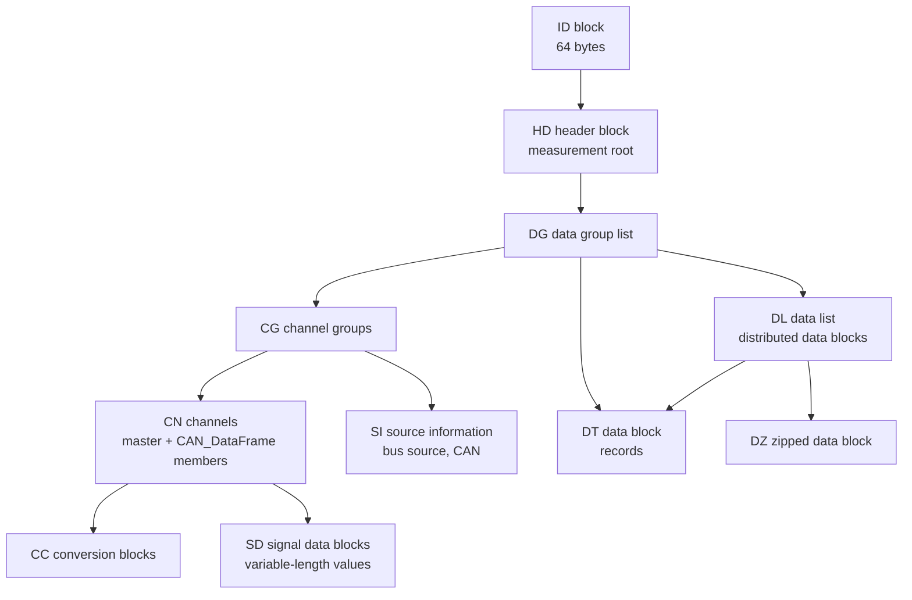
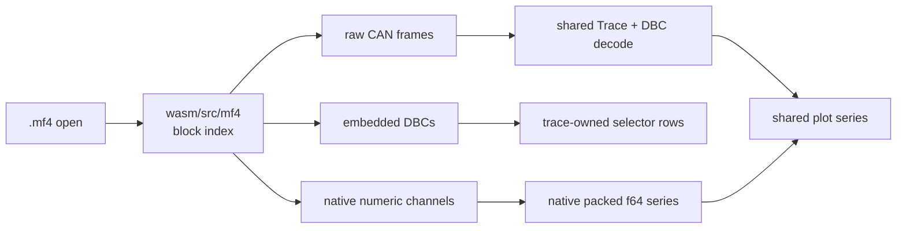

# ASAM MDF4 / MF4 CAN Trace Format

`.mf4` is the ASAM Measurement Data Format 4.x file extension. MDF4 is a standardized binary container for measurement data, including raw vehicle-bus events such as CAN, CAN FD, LIN, FlexRay, MOST, Ethernet, and newer service-oriented or sensor data. Unlike `.asc` and `.trc`, an MF4 file is not a line-oriented trace. Unlike BLF, the CAN frames are not a single object stream with fixed event records. MDF4 stores a linked graph of self-describing blocks, and CAN frames appear as records in channel groups that follow the ASAM MDF Bus Logging associated standard.

The current ASAM MDF version is **4.3.0**, released on **23 September 2025**. The open ASAM wiki currently documents the MDF 4.0/4.1 core model, and the full 4.3.0 standard is available through ASAM. Public implementation references are strong enough for a CAN-first parser: `asammdf`, `python-can`, MathWorks Vehicle Network Toolbox examples, CSS Electronics CANedge docs, and MDF validator tools all expose the same bus-logging concepts.

CAN Trace Viewer opens MF4 as a hybrid container. Raw `CAN_DataFrame` rows normalize into the existing `trace.Trace` model for normal DBC decoding. Embedded DBC attachments become temporary selector sources owned by the trace. Numeric measurement channels with a time master become native MF4 selector sources and plot directly. These sources can coexist in one file.

Persisted DBC files remain visible for every MF4 layout. MF4-native groups and embedded DBCs carry a visible `MF4` marker and disappear when their owning trace is replaced. Embedded ARXML is recognized but unsupported; first-class ARXML database support is tracked separately in [issue 115](https://github.com/tomrford/cantraceviewer/issues/115).

## Source materials

**ASAM MDF pages.** The ASAM MDF standard page identifies MDF as the current Measurement Data Format standard, lists `.mf4` as the file format, and describes the current 4.3.0 release. The ASAM MDF wiki documents the core block model: `ID`, `HD`, `DG`, `CG`, `CN`, `DT`, `DL`, `DZ`, `SD`, block links, sorted/unsorted data groups, compression, channel types, master channels, and bus logging.

**ASAM MDF Bus Logging references.** The public wiki summarizes the associated bus-logging standard: CAN bus traffic is stored as bus events; the CAN data-frame structure is named `CAN_DataFrame`; required members include `ID`, `DLC`, and `DataBytes`; optional members cover additional frame attributes. MathWorks examples name the CAN event structures `CAN_DataFrame`, `CAN_RemoteFrame`, `CAN_ErrorFrame`, and `CAN_OverloadFrame`.

**Open-source implementations.** `asammdf` is the most complete Python reference. It exposes groups, channel groups, source information, bus logging maps, decompression, sorted/unsorted record loading, DBC extraction, and CAN frame tabular export. `python-can` delegates MF4 reading and writing to `asammdf` and shows a narrow CAN-message API over MDF4 groups. Other useful references include `mdflib`, Vector's MDF Validator, and CANedge-generated MF4 samples.

**Practical CAN logger docs.** CSS Electronics documents CANedge MF4 output and the practical `CAN_DataFrame` member set: `BusChannel`, `ID`, `IDE`, `DLC`, `DataLength`, `DataBytes`, and `Dir`. It also documents the common logger pattern of appending raw CAN/LIN frames into unsorted MDF4 blocks for fast writing, then optionally sorting for faster reading.

## Binary structure

MDF4 starts with a fixed 64-byte `ID` block, followed directly by one `HD` header block. All other blocks may appear in arbitrary physical order. The logical structure comes from absolute byte-position links stored inside block link sections.

Every non-`ID` block has a common header and then type-specific links/data. Public readers model the common header as:

| Field        |    Size | Meaning                                                                       |
| ------------ | ------: | ----------------------------------------------------------------------------- |
| `id`         | 4 bytes | ASCII block ID such as `##HD`, `##DG`, `##CG`, `##CN`, `##DT`, `##DL`, `##DZ` |
| reserved     | 4 bytes | Alignment/reserved bytes                                                      |
| `length`     | 8 bytes | Total block length in bytes, including common header                          |
| `link_count` | 8 bytes | Number of 64-bit absolute file-position links following the header            |

The link section has `link_count` 64-bit links. A zero link is nil. Unknown block types should be skippable by declared length, but a parser that follows links must preserve enough address information to keep the graph consistent.

## Core blocks for a CAN-first reader

| Block          | Role                                   | CAN parser relevance                                                                       |
| -------------- | -------------------------------------- | ------------------------------------------------------------------------------------------ |
| `ID`           | File identification and MDF version    | Validate MDF4/MF4 input and reject MDF3 `.mdf` files                                       |
| `HD`           | File root, start time, top-level lists | Read measurement start time and first `DG` link                                            |
| `DG`           | Data group                             | Find its `CG` list and data-block/data-list link                                           |
| `CG`           | Channel group                          | Identify bus-event groups, record ID, cycles, sample bytes, invalidation bytes, and source |
| `SI`           | Source information                     | Confirm source type is bus and bus type is CAN                                             |
| `CN`           | Channel                                | Locate master time channel and `CAN_DataFrame.*` member channels                           |
| `CC`           | Channel conversion                     | Convert master time raw value to seconds when conversion is not identity                   |
| `DT`           | Data block                             | Read records directly                                                                      |
| `DL`           | Data list                              | Walk distributed `DT`/`DZ` blocks                                                          |
| `HL`           | Header list                            | Dispatch linked lists of data blocks, especially compressed data                           |
| `DZ`           | Zipped data block                      | Decompress deflate-compressed record sections                                              |
| `SD`           | Signal data block                      | Read variable-length signal data if a file stores payloads through VLSD indirection        |
| `MD`/`TX`      | Metadata and text                      | Useful for comments, XML names, and diagnostics; not required for frame extraction         |
| `FH`/`EV`/`AT` | File history, events, attachments      | Follow embedded DBC attachments; report embedded ARXML as unsupported                      |

MDF4 4.1 introduced `DZ` compressed data blocks using Deflate/zlib. MDF 4.3.0 adds newer associated standards and compression options. The first cantraceviewer parser should accept uncompressed `DT` and Deflate `DZ`, and return a clear unsupported-compression error for other compression modes.

## Records, sorted data, and unsorted data

The MDF record model is channel-oriented. A channel group defines a fixed record layout through its child channels. Records in that channel group share the same master channel, usually time. Master-channel physical values are seconds relative to the measurement start stored through the `HD` block.

A sorted data group has one channel group and records of one fixed layout. The record ID may be omitted, so the parser can stride through the data block by the channel group's sample-byte count.

An unsorted data group has multiple channel groups and a mixed data block. Each record starts with a record ID that maps the bytes to one child channel group. This model is common for fast loggers because frames can be appended as they arrive without buffering one sorted stream per bus/channel/message. A parser cannot assume sorted input; it must handle both:

- sorted `DG -> CG -> DT/DL/DZ` with implicit record layout;
- unsorted `DG -> multiple CG -> shared DT/DL/DZ` with record IDs.

`DL` blocks distribute one logical record stream across multiple data blocks. `DZ` blocks may appear behind `DL` or `HL`. Decompression yields raw record bytes; record dispatch still follows the data group and channel group metadata.

## CAN bus-logging model

The ASAM bus-logging model stores CAN frames as structure channels. The channel-group source identifies the bus system, and the channel names identify the event structure. Public readers use the same recognition pattern:

- `CG.flags` marks a bus event group.
- `CG.acq_source`/`SI` identifies a bus source with CAN bus type.
- A channel named `CAN_DataFrame` or member channels named `CAN_DataFrame.*` identify raw data frames.
- Remote, error, and overload events use `CAN_RemoteFrame`, `CAN_ErrorFrame`, and `CAN_OverloadFrame`.

For this repo, the first supported event type should be `CAN_DataFrame`. Remote and error frames can map to the existing `trace_frame.Kind.remote` and `trace_frame.Kind.error_frame` after data frames are stable. Overload frames can be skipped or recorded as `unknown` until the UI has a reason to expose them.

### `CAN_DataFrame` members

The member set varies by producer and MDF version. The parser should recognize these names with the event prefix and dot separator, e.g. `CAN_DataFrame.ID`.

| Member       | Meaning                           | Mapping                                                           |
| ------------ | --------------------------------- | ----------------------------------------------------------------- |
| `BusChannel` | CAN bus/channel number            | Not currently stored in `trace.Frame`; useful later for filtering |
| `ID`         | 11-bit or 29-bit CAN identifier   | `trace_frame.Id.value`, masked to `0x1fffffff`                    |
| `IDE`        | Identifier extension flag         | `trace_frame.Id.is_extended`                                      |
| `DLC`        | Raw CAN DLC                       | `trace_frame.Frame.dlc`                                           |
| `DataLength` | Actual payload length             | `trace_frame.Frame.payload_len`, capped to 64 for CAN FD          |
| `DataBytes`  | Payload bytes                     | copied to `trace.Trace.payloads`                                  |
| `Dir`        | Direction, usually Rx/Tx          | Not currently stored                                              |
| `EDL`        | CAN FD extended-data-length flag  | `trace_frame.Frame.is_fd` when present and true                   |
| `BRS`        | CAN FD bit-rate-switch flag       | Not currently stored                                              |
| `ESI`        | CAN FD error-state-indicator flag | Not currently stored                                              |

Classic CAN has up to 8 data bytes. CAN FD uses `DataLength` for the actual byte count and can carry up to 64 bytes. Preserve raw `DLC` separately from payload length because the existing trace model already distinguishes them and DBC matching depends on the actual payload bytes, not textual export conventions.

## Channel decoding rules

MDF4 `CN` blocks describe where and how a channel value is stored: byte offset, bit offset, bit count, data type, channel type, optional invalidation bits, and optional conversion. A CAN parser should avoid hard-coded record structs and instead build a small channel extractor from the `CN` metadata.

Minimum extractors:

- unsigned integer channels up to 64 bits for `ID`, `DLC`, `DataLength`, flags, and bus channel;
- fixed byte-array channels for common `DataBytes`;
- MLSD payload channels where a maximum byte array and a size channel share the record;
- master time channels with identity or linear conversion to seconds.

Deferred extractors:

- VLSD payloads through `SD` blocks;
- string-valued `Dir` channels when producers store Rx/Tx as text rather than an integer enum;
- invalidation-bit filtering;
- non-linear conversion rules outside master time.

Core block/link integers are read as MDF4 structural integers. Channel payload values must follow the byte order and type declared by each `CN`; MDF supports Intel and Motorola data representations at the channel level.

## Time handling

`HD` stores the absolute measurement start. Master time channels in records store values relative to that start, with physical values in seconds. The repo's trace model stores relative nanoseconds in `Frame.timestamp_ns` and optional absolute measurement start milliseconds in `Trace.measurement_start_ms`.

Parser policy:

- Convert master-channel physical seconds to `u64` nanoseconds using checked arithmetic and a bounded rounding policy.
- Keep `measurement_start_ms` nullable when the `HD` timestamp is absent or cannot be represented cleanly.
- Do not derive absolute frame timestamps in the trace rows; keep the current relative-time model.
- Preserve monotonically increasing expectations per record ID, but do not reject a whole file solely because a producer emits equal or slightly out-of-order bus events. Diagnostics are more useful than strict rejection for real logger output.

## Implementation in this repo

MF4 is a separate parser domain behind the shared trace handle. One retained MF4 document owns the block index and supports raw, embedded-DBC, native-channel, and hybrid layouts.

The reader validates linked blocks, handles sorted and unsorted record layouts, walks `DL` and `HL` data chains, and inflates Deflate `DZ` blocks with the same bounded `fdeflate` implementation used by BLF. Raw CAN support covers fixed `DataBytes` channels for classic CAN and CAN FD plus remote and error event groups.

Native plotting includes scalar little- and big-endian integers and 32/64-bit floats. Identity, linear, rational, interpolated-table, and nearest-table conversions are supported. Master time and invalidation bits are applied before a sample enters the packed time/value series. Unsupported channel encodings stay out of the selector rather than producing incorrect values.

Embedded DBC attachments may be uncompressed or zlib-compressed. The 1 MiB DBC limit applies to the decompressed bytes. External attachment references cannot be opened in the browser and produce a warning.

The browser trace cap remains the existing trace-file cap. The parser should reject oversized internal allocations even when the browser cap has already accepted the file; `DZ.original_size`, `DL` block totals, `CG.cycles_nr * samples_byte_nr`, and `SD` payload lengths are all attacker-controlled.

## Parser-relevant edge cases

- **MDF3 vs MDF4.** `.mdf` and old MDF3 files are different enough to reject in the MF4 parser.
- **Unfinalized recordings.** `UnFinMF` files require producer-specific finalization corrections and are rejected with an instruction to finalize the recording first.
- **Version spread.** MDF 4.00, 4.10, 4.11, 4.20, and 4.30 files exist. Start with the block types needed for 4.10/4.11 CAN bus logging; reject newer unsupported compression explicitly.
- **Physical order is arbitrary.** Do not parse by sequential block order except for the fixed `ID` then `HD` start. Follow links.
- **Sorted and unsorted layouts.** CAN loggers commonly write unsorted raw bus data for fast append. A sorted-only parser will miss real files.
- **Record IDs.** In unsorted groups, record ID size and channel-group record IDs determine dispatch. The record ID is not a CAN ID.
- **Data block fan-out.** Records can live in direct `DT`, distributed `DL`, compressed `DZ`, or a header-list chain.
- **Payload storage.** `DataBytes` may be a fixed array, MLSD in-record maximum-length storage, or VLSD/`SD` indirection. Fixed arrays should come first; MLSD is important for CAN FD.
- **Channel naming.** Public tools use `CAN_DataFrame.ID` style names, but names can also be represented through structure channels. Build lookup from the channel tree, not only flat string matching.
- **Optional fields.** `Dir`, `IDE`, `EDL`, `BRS`, and `ESI` may be absent. Derive standard vs extended IDs from `IDE` when present; otherwise use value range as a fallback.
- **Invalidation bits.** Samples marked invalid are omitted from native MF4 series.
- **Attachments.** Embedded DBC files are temporary selector sources. External DBC references warn. Embedded ARXML warns and points to issue 115.
- **Memory pressure.** `DZ` decompression and `DL` aggregation can create large temporary buffers. Prefer streaming per data block and appending normalized frames/payloads rather than materializing whole measurement data.

## Open-source parser comparison

| Tool                              | Language    | Licence            | MF4 role                                              | CAN bus-logging support                                           |
| --------------------------------- | ----------- | ------------------ | ----------------------------------------------------- | ----------------------------------------------------------------- |
| `asammdf`                         | Python      | LGPL-3.0-or-later  | Broad MDF2/3/4 reader, writer, converter, GUI backend | Strong; DBC extraction, bus logging maps, sorted/unsorted loading |
| `python-can` MF4                  | Python      | LGPL-3.0-only      | CAN-message reader/writer facade over `asammdf`       | Good API reference for CAN, CAN FD, remote/error handling         |
| `mdflib`                          | C++         | MIT                | MDF3/4 reader/writer library                          | Useful structural reference; broader measurement focus            |
| MathWorks Vehicle Network Toolbox | MATLAB      | Commercial         | MDF read/decode/write examples                        | Good naming and event-type reference                              |
| CSS Electronics CANedge tools     | Python/docs | Mixed/open tooling | Real-world CAN logger examples and samples            | Useful CANedge MDF 4.11 sample corpus                             |

## Minimum regression corpus

- Minimal MDF4 sorted `CAN_DataFrame` with one classic 8-byte frame.
- Sorted classic CAN file with standard and extended IDs.
- Sorted CAN FD file with `EDL`, `BRS`, `ESI`, raw `DLC`, and `DataLength` greater than 8.
- Unsorted raw bus-logging file with multiple channel groups and record IDs.
- Multi-block `DL` file.
- Deflate `DZ` file.
- File with optional `Dir` absent.
- File with `CAN_RemoteFrame`, `CAN_ErrorFrame`, and `CAN_OverloadFrame` groups present beside data frames.
- File with malformed links, truncated block length, impossible `DZ.original_size`, and oversized record counts.
- Real public CANedge J1939 or OBD2 MF4 sample paired with a DBC for end-to-end plot validation.
- Decoded-only MF4 with multiple numeric channels and a shared time master.
- Hybrid MF4 containing raw CAN frames, native decoded channels, and a compressed embedded DBC.

## References

- [ASAM MDF standard page](https://www.asam.net/standards/detail/mdf/)
- [ASAM MDF wiki](https://www.asam.net/standards/detail/mdf/wiki/)
- [python-can MF4 reader source](https://python-can.readthedocs.io/en/stable/_modules/can/io/mf4.html)
- [asammdf MDF facade source](https://asammdf.readthedocs.io/en/master/_modules/asammdf/mdf.html)
- [asammdf MDF4 block source](https://asammdf.readthedocs.io/en/master/_modules/asammdf/blocks/mdf_v4.html)
- [MathWorks CAN data from MDF example](https://www.mathworks.com/help/vnt/ug/read-data-from-mdf-files-using-arxml.html)
- [CSS Electronics MF4/MDF4 overview](https://www.csselectronics.com/pages/mf4-mdf4-measurement-data-format)
